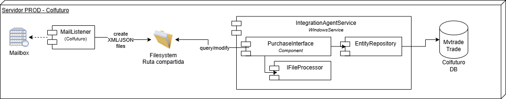

# IntegrationAgentService

Windows Service responsible for monitoring and processing XML files located in a shared network path. These files follow the DIAN schema for electronic invoices related to purchases. The service extracts relevant data and indexes it into the existing schema of the ERP .

Servicio de Windows encargado de monitorear y procesar archivos XML ubicados en una ruta compartida de red. Estos archivos cumplen con el esquema DIAN para facturas electrónicas relacionadas con compras. El servicio extrae la información relevante y la indexa en el esquema existente de la base de datos del ERP.

## Publish the service

dotnet publish -c Release -r win-x64 --self-contained true -o ./publish

## Install the service

sc.exe create IntegrationAgentService binPath= "D:\NICOLASD\PERSONAL\CC SISTEMAS\OFIMATICA\COLFUTURO\IntegrationAgentService\IntegrationAgentService\publish\IntegrationAgentService.exe" DisplayName= "Agente de Integración - CC Sistemas Windows Service"

sc.exe start IntegrationAgentService

sc.exe stop IntegrationAgentService

sc.exe delete IntegrationAgentService

Note: For MacOS, run: dotnet start - it will run the Windows Service as a console app.